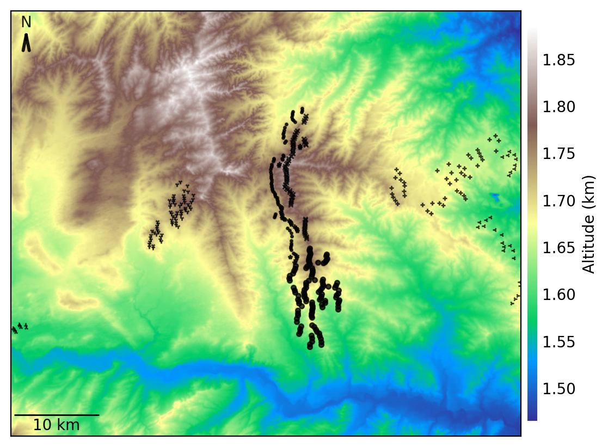
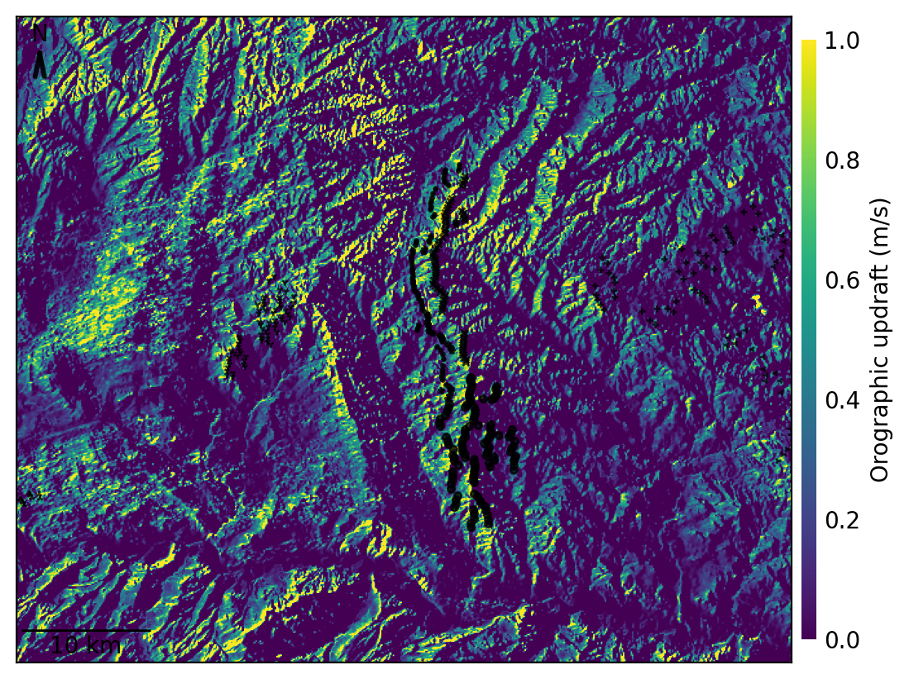
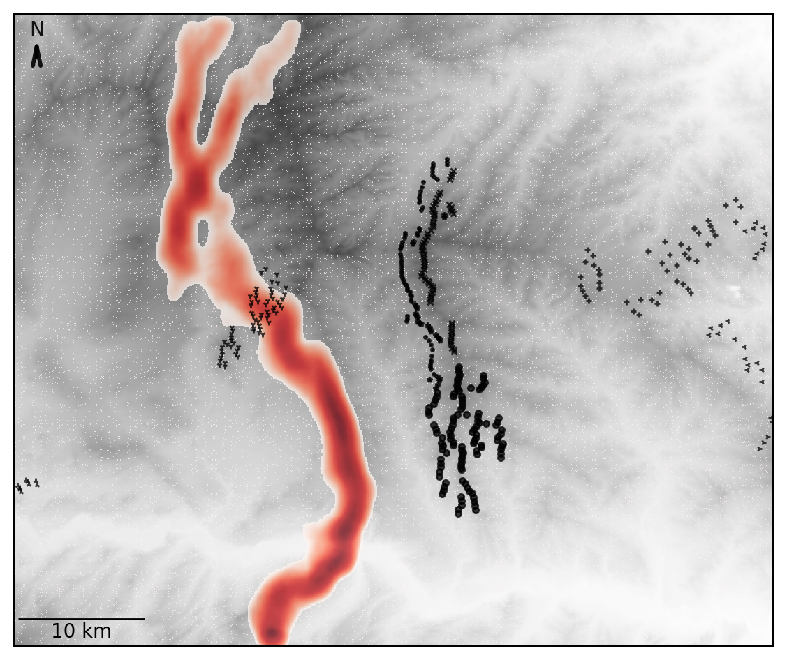

Stochastic Soaring Raptor Simulator (SSRS)
===========================================

The goal of SSRS is to predict movements of soaring raptors (such as
Golden Eagles) for a given wind conditions with the aim of determining
potential negative conflict between soaring raptors and wind
turbines. SSRS uses a stochastic agent-based model for predicting raptor
movements through an orographic updraft field estimated using the
spatially varying wind conditions and ground features (altitude, slope, aspect).
SSRS can be applied to any rectangular region within the US without the
need for any eagle-centric or atmosphere-related data collection efforts, using
only the publically available data sources. SSRS implements and extends the
capability of the fluid-flow model from 'Brandes, D., & Ombalski, D. (2004). 
Modelling raptor migration pathways using a fluid-flow analogy. The Journal
of Raptor Research, 38(3), 195-207.'

SSRS uses the following publically available data sources:

* USGS's `3D Elevation Program (3DEP) <https://www.usgs.gov/core-science-systems/ngp/3dep>`_ dataset for terrain altitude, slope and aspect at a spatial resolution of 10 meters within the US.
* USGS's `United States Wind Turbine Database (USWTDB) <https://eerscmap.usgs.gov/uswtdb/>`_ for up-to-date turbine locations within the US.
* NREL's `Wind ToolKit (WTK) <https://www.nrel.gov/grid/wind-toolkit.html>`_ dataset for atmospheric conditions such as wind speed and direction at 1-hour temporal resolution and 2 km spatial resolution within the US.

SSRS operates under three modes: 

* **Uniform**: Uses uniform wind speed and direction across the target region.
* **Snapshot**: Uses wind conditions for a specific time imported from WTK dataset.
* **Seasonal**: Uses wind conditions randomly sampled from a range of dates or months or time of day from the WTK dataset.

Installation
--------------

Clone the GitHub repository on local machine,
cd into the SSRS directory and using
conda virtual environments from
`Anaconda <https://docs.anaconda.com/anaconda/install/index.html>`_, do:

.. code-block:: bash

    conda env create -f environment.yml
    conda activate ssrs_env
    pip install .

For editable install (for development purpose), do

.. code-block:: bash

    conda env create -f environment.yml
    conda activate ssrs_env
    pip install -e .

For running conda environment ssrs_env in Jupyter Notebook (Comes with Anaconda),

.. code-block:: bash

    conda install ipykernel
    ipython kernel install --user --name=ssrs_env

Without Anaconda (requires python>=3.8 and pip>21.3):

.. code-block:: bash

    pip install git+https://github.com/NREL/SSRS.git#egg=ssrs

For SSRS to access NREL's WTK dataset in the snapshot mode, need to get an
API key from https://developer.nrel.gov/signup/ and save it in .hscfg file
located in the working directory. Both examples/ and notebooks/ directories
contain a sample .hscfg_need_api_key file. Make sure to rename this file as
.hscfg after inserting your API key in this file. 

Usage
--------------

The Jupyter notebooks in notebooks/ and python scripts in examples/ show the
usage of SSRS for a given region. For instance, ssrs simulation in uniform mode
for a 60 km by 50 km region in Wyoming and simulating 500 eagles travelling
north can be implemented using the following code:

.. _notebook: notebooks/sample_ssrs_uniform.ipynb

.. code-block:: python

    from ssrs import Simulator, Config
    config_uniform = Config(
        run_name='run_wy',
        southwest_lonlat=(42.78, -106.21), 
        region_width_km=(60., 50.),
        resolution=100.,
        sim_mode='uniform',
        uniform_winddirn=270.,
        track_direction='north',
        track_count = 500,
        track_start_region=(20, 21, 0, 0)
    )
    sim = Simulator(config_uniform)
    sim.simulate_tracks()
    sim.plot_terrain_elevation(show=True)
    sim.plot_simulation_output(show=True)

This will produce the following figures:

Ground elevation and turbine locations:

Orographic updrafts:

1000 simulated tracks travelling towards north:

.. image:: docs/figs/s10d270_north_tracks.png
    :width: 400 px
    :align: right
    :alt: 

Relative eagle presence density

Configuration
--------------

SSRS settings can be changed through a set of parameters defined using
ssrs.Config attribute. The default setting can be viewed through following code:

.. code-block:: python

    from ssrs import Config
    print(Config())

Here is a description of the parameters available to the users to vary:

.. code-block:: python

    run_name: str = 'default'  # name of this run, determines directory names
    out_dir: str = os.path.join(os.path.abspath(os.path.curdir), 'output')
    max_cores: int = 8  # maximum number of cores to use
    sim_mode: str = 'uniform'  # snapshot, seasonal, uniform

Parameters for setting up the region:

.. code-block:: python

    southwest_lonlat: Tuple[float, float] = (42.78, -106.21)
    projected_crs: str = 'ESRI:102008'  # ESRI, EPSG, PROJ4 or WKT string
    region_width_km: Tuple[float, float] = (30., 20.)
    resolution: int = 100.  # desired terrain resolution (meters)

Parameters for setting up the uniform mode:

.. code-block:: python

    uniform_winddirn: float = 270.  # northerly = 0., easterly = 90, westerly=270
    uniform_windspeed: float = 10.  # uniform wind speed in m/s

Parameters for setting up the snapshot mode:

.. code-block:: python

    snapshot_datetime: Tuple[int, int, int, int] = (2010, 6, 17, 13)

Parameters for setting up the seasonal mode:

.. code-block:: python

    seasonal_start: Tuple[int, int] = (3, 1)  # start of season (month, day)
    seasonal_end: Tuple[int, int] = (12, 1)  # end of season (month, day)
    seasonal_timeofday: str = 'daytime'  # morning, afternoon, evening, daytime
    seasonal_count: int = 8  # number of seasonal updraft computations

Parameters for importing data from WindToolKit dataset: 

.. code-block:: python

    wtk_source: str = 'AWS'  # 'EAGLE', 'AWS', 'EAGLE_LED'
    wtk_orographic_height: int = 100  # WTK wind conditions at this height
    wtk_thermal_height: int = 100  # WTK pressure, temperature, at this height
    wtk_interp_type: str = 'linear'  # 'nearest' 'linear' 'cubic'

Parameters for simulating tracks:

.. code-block:: python

    track_direction: str = 'north'  # south,north,east,west,nwest,neast,swest,seast
    track_count: str = 100  # number of simulated eagle tracks
    track_start_region: Tuple[float, float, float, float] = (5, 45, 0, 0)
    track_start_type: str = 'random'  # uniform, random
    track_stochastic_nu: float = 1.  # scaling of move probs, 0 = random walk
    track_dirn_restrict: int = 2  # options: 0,1,2

Parameters for plotting:

.. code-block:: python

    fig_height: float = 6. # height of the figure window
    fig_dpi: int = 200  # increase this to get finer plots
    turbine_minimum_hubheight: float = 50.  # for plotting turbine locations
    turbine_mrkr_styles = ('1k', '2k', '3k', '4k',
                           '+k', 'xk', '*k', '.k', 'ok')
    turbine_mrkr_size: float = 3. # marker size for plotting turbines
    turbine_box_around_wfarm: bool = False # to plot box around a plant
    presence_smoothing_radius: bool = 10  # smoothing radius in meters for presence maps

Developers
-----------

* Rimple Sandhu, National Renewable Energy Laboratory rimple.sandhu@nrel.com
* Charles Tripp, National Renewable Energy Laboratory, charles.tripp@nrel.gov
* Eliot Quon, National Renewable Energy Laboratory
* Regis Thedin, National Renewable Energy Laboratory
* Lindy Williams, National Renewable Energy Laboratory
* Paula Doubrawa, National Renewable Energy Laboratory
* Caroline Draxl, National Renewable Energy Laboratory
* Mike Lawson, National Renewable Energy Laboratory

Citation
--------------
Sandhu, Rimple, Tripp, Charles, Quon, Eliot, Thedin, Regis, Williams, Lindy, Doubrawa, Paula, Draxl, Caroline, and Lawson, Mike. SSRS (Stochastic Soaring Raptor Simulator). Computer Software. https://github.com/NREL/SSRS. USDOE Office of Energy Efficiency and Renewable Energy (EERE), Renewable Power Office. Wind Energy Technologies Office. 18 Oct. 2021. Web. doi:10.11578/dc.20210903.2.

